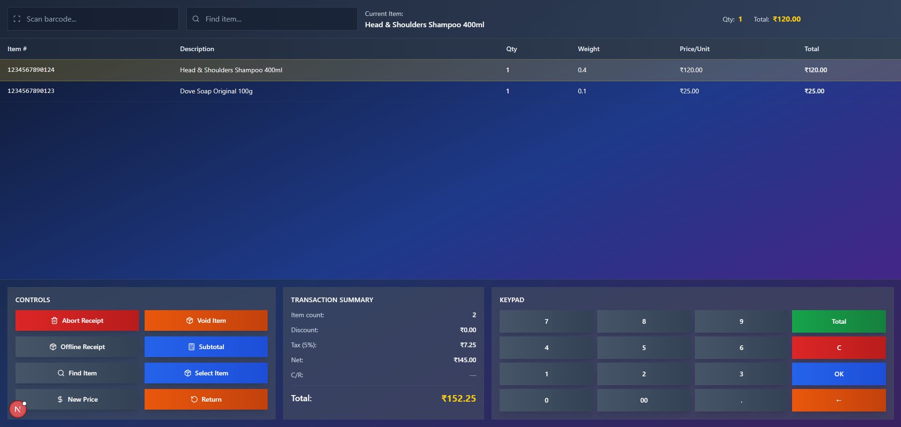

# Next.js POS System



## Overview

This is a modern, responsive Point of Sale (POS) system built with Next.js, React, and Tailwind CSS. It is designed for retail environments and supports barcode scanning, item search, cart management, and receipt operations. The UI is clean, fast, and optimized for both desktop and touch devices.

---

## Features

- **Barcode Scanning**: Quickly add items to the cart by scanning barcodes or typing them in.
- **Item Search**: Find products by name or description using the search bar.
- **Cart Management**: View, select, update quantity, change price, or void items in the cart.
- **Receipt Actions**:
  - Abort entire receipt
  - Void individual items
  - Apply discounts
  - Mark items for return
  - Offline receipt simulation
- **Summary Panel**: See item count, discount, tax, net, and total in real time.
- **Keypad**: On-screen keypad for quick input and total calculation.
- **Responsive Design**: Works great on desktops, tablets, and POS terminals.

---

## Demo Barcodes & Items

Try these barcodes and descriptions to test the POS system:

| Barcode        | Description                        |
|---------------|------------------------------------|
| 1234567890123 | Dove Soap Original 100g            |
| 1234567890124 | Head & Shoulders Shampoo 400ml     |
| 1234567890125 | Colgate Strong Teeth 200g          |
| 1234567890126 | Lux Soap Rose 100g                 |
| 1234567890127 | Pantene Shampoo Gold 340ml         |
| 1234567890128 | Dettol Antiseptic Liquid 550ml     |
| 1234567890129 | Maggi Noodles Masala 70g           |
| 1234567890130 | Britannia Good Day Cookies 100g    |
| 1234567890131 | Tata Salt 1kg                      |
| 1234567890132 | Amul Butter 500g                   |

You can also search by product name, e.g. `Dove`, `Shampoo`, `Maggi`, etc.

---

## Installation & Setup

1. **Clone the repository:**
   ```sh
   git clone https://github.com/johnkhore5911/POS-SYSTEM.git
   cd POS-SYSTEM
   ```
2. **Initialize git (if needed):**
   ```sh
   git init
   ```
3. **Install dependencies:**
   ```sh
   npm install --legacy-peer-deps
   ```
4. **Build the project:**
   ```sh
   npx next build
   ```
5. **Start the development server:**
   ```sh
   npx next dev
   ```
6. **Open your browser:**
   Visit [http://localhost:3000](http://localhost:3000)

---

## How to Use

- **Scan or Enter Barcode**: Use the barcode input at the top to add items.
- **Search for Items**: Use the search bar to find products by name or description.
- **Cart Table**: Click on items to select them for further actions.
- **Control Panel Buttons:**
  - **Abort Receipt**: Clears all items from the cart.
  - **Void Item**: Removes the selected item from the cart.
  - **Offline Receipt**: Simulates an offline transaction (demo only).
  - **Subtotal**: Apply a discount to the current receipt.
  - **Find Item**: Focuses the search input for quick lookup.
  - **Select Item**: Update the quantity of the selected item.
  - **New Price**: Change the price of the selected item.
  - **Return**: Mark the selected item as returned (negative quantity).
- **Summary Panel**: Shows a breakdown of the transaction.
- **Keypad**: Use for quick numeric input and to show the current total.

---

## Technologies Used
- Next.js
- React
- Tailwind CSS
- TypeScript

---

## Contact

**Author:** John  
**Email:** johnkhore26@gmail.com

---

Enjoy using your POS system! If you have any questions or suggestions, feel free to reach out. 